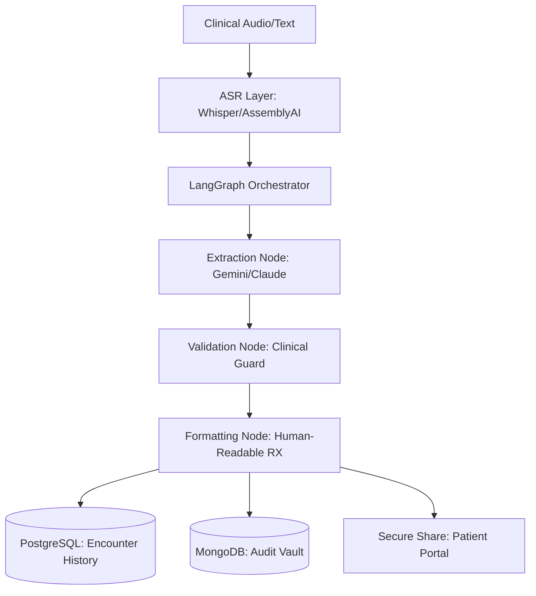

<p align="center">
  
</p>

# Superhumanly Doctors: Clinical Intelligence Hub

[](https://www.python.org/)
[](https://fastapi.tiangolo.com/)
[](https://react.dev/)
[](https://langchain-ai.github.io/langgraph/)
[](https://aws.amazon.com/bedrock/)
[](https://www.hhs.gov/hipaa/index.html)

**Superhumanly Doctors** is a B2B AI-powered clinical intelligence platform designed to liberate physicians from the burden of documentation. By converting raw clinical conversations into high-fidelity structured medical summaries and prescriptions, it acts as a "technical sovereign" assistant that ensures physicians can focus 100% on patient care.

---

## 🚀 Core Capabilities

### 🎙️ Ambient Clinical Intake
High-fidelity audio transcription using **Faster-Whisper** and **AssemblyAI**, optimized for medical terminology and noisy clinical environments.

### 🧠 Intelligent Extraction
An agentic **LangGraph** pipeline that performs multi-stage clinical synthesis:
- **Medical Summary**: Jargon-free, structured patient narratives.
- **Structured RX**: Automated prescription extraction with pharmacy-ready schemas.
- **Risk Scoring**: Real-time identification of clinical red flags (Sepsis, Fall risk).

### 📊 Institutional Command Center
A premium administrative console for clinic-wide oversight:
- **Live Telemetry**: Real-time system health (CPU, Memory, Latency).
- **Immutable Audit Vault**: Non-repudiable logs for compliance and governance.
- **Node Management**: Granular control over clinic registration and physician access.

---

## 🏗️ Architecture at a Glance



---

## 🛠️ Getting Started

### Prerequisites
- Docker & Docker Compose
- API Keys: `OPENAI_API_KEY` or `AWS_ACCESS_KEY` (for Bedrock)

### Quick Start (Demo Mode)
1. **Clone and Initialize**:
   ```bash
   git clone https://github.com/superhumanly/healthcare.git
   cd healthcare
   cp .env.example .env
   ```
2. **Launch Infrastructure**:
   ```bash
   docker-compose up --build -d
   ```
3. **Access Portals**:
   - **Physician Portal**: `http://localhost:5173`
   - **Admin Console**: `http://localhost:5173/admin`
   - **API Docs**: `http://localhost:8000/docs`

---

## 📚 Documentation Directory

For deeper insights into the platform, explore our specialized guides:

| Guide | Description |
|-------|-------------|
| [**Physician's Manual**](docs/user/README.md) | Full workflow guide for clinical encounters. |
| [**Institutional Admin Guide**](docs/admin/README.md) | Managing clinics, telemetry, and audits. |
| [**Technical Spec**](docs/architecture/README.md) | Deep dive into the LangGraph & Data layers. |
| [**API Reference**](docs/api/README.md) | Comprehensive V1 endpoint documentation. |
| [**Demo Script**](docs/demo/README.md) | The "Golden Path" for presentations. |

---

<p align="center">
  Built with ❤️ by the Superhumanly Team.
</p>
