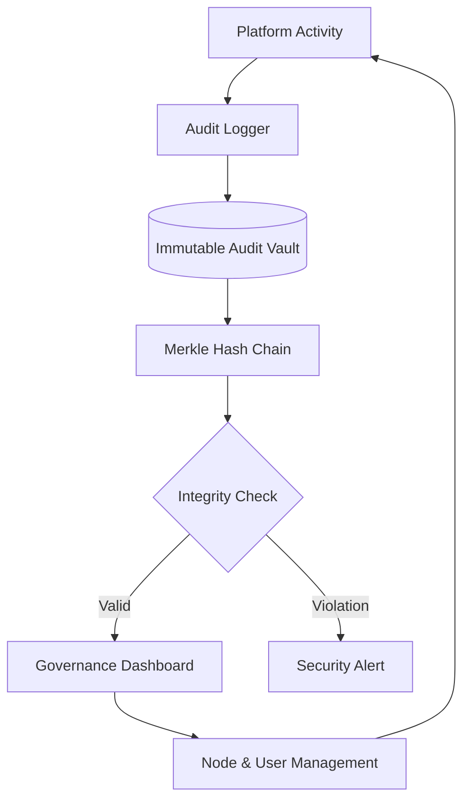

# Institutional Admin Guide: Governance & Oversight

The Superhumanly Doctors Administrative Command Center is a high-fidelity governance tool designed for clinical administrators and IT sovereigns.

---

## 1. Governance Dashboard

The **Admin Dashboard** provides a population-level overview of the platform's utilization and impact.

### 📈 Clinical Analytics
- **Trial Growth**: Monitor the adoption of the platform across your institution.
- **Role Distribution**: Analyze usage patterns across different clinical specialties.
- **System Utilization**: High-level counts of active doctors and processed encounters.

### 🔌 Infrastructure Telemetry
Real-time monitoring of the system's "vital signs":
- **CPU & Memory**: Monitor server load during peak clinical hours.
- **Latency (ms)**: Track the responsiveness of the extraction pipeline.
- **Disk Health**: Ensure storage availability for the Immutable Audit Vault.

---

## 2. Institutional Registry

### Clinic Management
Administrators can register and manage clinical entities via the **Clinic Registry** tab.
- **Onboarding**: Create new clinic nodes with unique nomenclature and contact data.
- **Logical Isolation**: Each clinic is a separate logical silo, ensuring strict data residency and access controls.

### User Management
- **Role Promotion**: Elevate physicians to the **Administrative Sovereign** role to delegate governance tasks.
- **Trial Oversight**: Review and process trial requests from prospective users.

---

## 3. The Immutable Audit Vault

The **Audit Vault** is the foundation of our compliance and security architecture. Every clinical action is captured in a non-repudiable ledger.

### Merkle Chain Verification
The vault utilizes a Merkle-chain structure where each log entry is hashed with its predecessor.
- **Integrity Verification**: Click the **"Verify Vault"** button to trigger a full-chain integrity check.
- **Tamper Detection**: If the chain hash is inconsistent, the system will immediately flag a "Vault Integrity Violation," alerting the administrator to potential tampering.

### Audit Feed
A live feed of the most recent actions, including:
- User login/logout events.
- Clinical extraction triggers.
- Record access and sharing events.

---

## 🏗️ Administrative Oversight Loop

