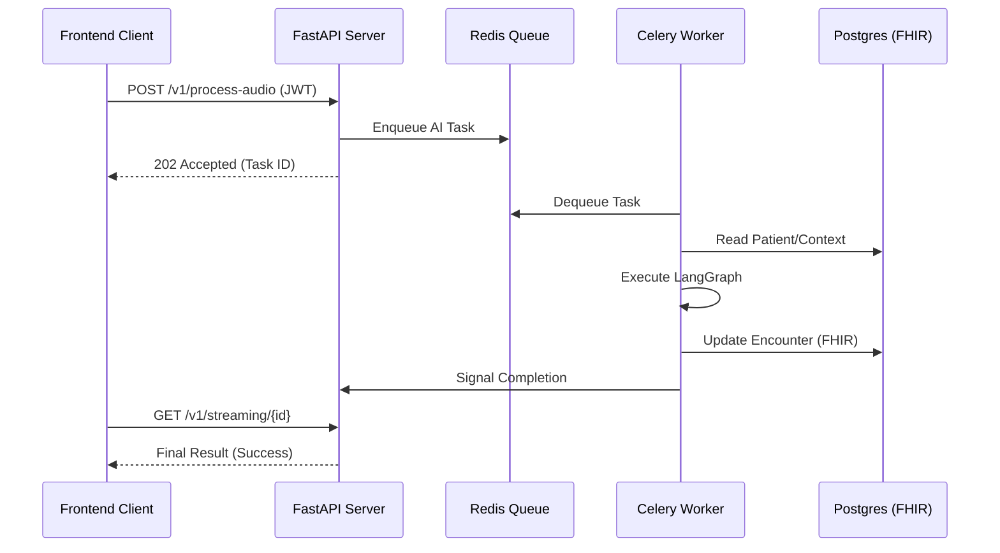

# API Reference Guide: Clinical & Administrative Endpoints

This guide documents the primary V1 endpoints of the Superhumanly Doctors platform. The API follows RESTful principles and uses JWT-based Bearer authentication.

---

## 🔐 Authentication

All non-public endpoints require a `Bearer` token in the `Authorization` header.

### `POST /v1/auth/login`
**Role**: Public
**Purpose**: Authenticate user and receive access token.

---

## 🎙️ Clinical Processing

### `POST /v1/process-audio`
**Role**: Doctor
**Purpose**: The primary entry point for ambient clinical extraction.
**Payload**: `multipart/form-data` containing an `audio` file and optional `customer_id`.
**Response**: 
```json
{
  "task_id": "celery-uuid-123",
  "status": "PROCESSING",
  "message": "Clinical extraction pipeline initiated."
}
```

### `GET /v1/streaming/{task_id}`
**Role**: Doctor
**Purpose**: WebSocket or Long-Polling endpoint to receive Strategy 5 partial results.
**Response Segment**:
```json
{
  "status": "PROGRESS",
  "meta": {
    "current_node": "extraction",
    "partial_result": {
      "cleaned_text": "Patient reports sore throat...",
      "patient_summary": "You have a minor throat infection...",
      "rx_text": "Amoxicillin 500mg BID x 7 days"
    }
  }
}
```

---

## 🏛️ Administrative Governance

### `GET /v1/admin/health/telemetry`
**Role**: Admin
**Purpose**: Retrieve real-time infrastructure metrics.
**Response**:
```json
{
  "cpu_usage": 14.5,
  "memory_percent": 42.1,
  "disk_percent": 68.2,
  "latency_ms": 48.5
}
```

### `GET /v1/admin/audit/verify`
**Role**: Admin
**Purpose**: Trigger a cryptographic integrity check of the Audit Vault.
**Response**:
```json
{
  "status": "verified",
  "count": 1245,
  "last_hash": "a8f2...9b1c",
  "integrity_score": 1.0,
  "message": "Audit vault integrity confirmed. No tampering detected."
}
```

---

## 📂 Resource Management (FHIR Aligned)

### `GET /v1/customers`
**Role**: Doctor / Admin
**Purpose**: Retrieve patient list (clinic-scoped).

### `GET /v1/encounters/{encounter_id}`
**Role**: Doctor
**Purpose**: Retrieve full clinical encounter details including FHIR payloads.

---

## 🏗️ Data Flow Visualization


