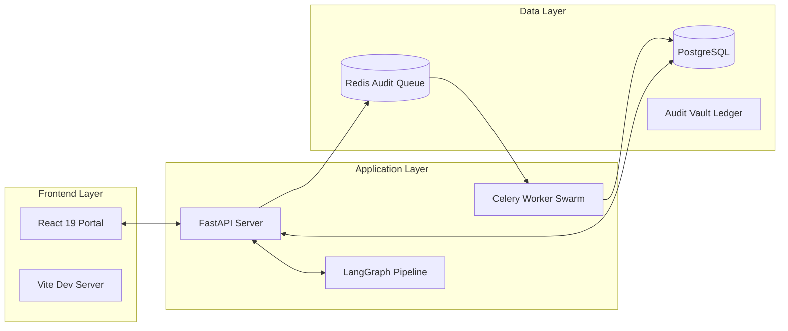

# Technical Specification: Architecture & Intelligence

This document provides a deep dive into the engineering principles and architectural components that power the Superhumanly Doctors clinical intelligence platform.

---

## 1. System Architecture

The platform is built as a high-performance, asynchronous microservice architecture centered around **FastAPI** and **LangGraph**.

### Core Stack
- **API Framework**: FastAPI (CPython, Async/Await)
- **Database Layer**: SQLModel (Relational ORM) with PostgreSQL (Production) or SQLite (Local).
- **Audit Batching**: Redis-backed queue for asynchronous audit log persistence.
- **Agentic Engine**: LangGraph for multi-stage clinical extraction and reasoning.
- **AI Models**: AWS Bedrock (Claude 3.5 Sonnet / Haiku) and OpenAI (GPT-4o).

### System Topology

---

## 2. Data Persistence & FHIR Native Storage

The platform utilizes a **Relational-Native FHIR** approach, where clinical entities are stored in SQL tables but mapped directly to standard FHIR resources.

### Relational Schema
- **User & Clinic**: Multi-tenant identity management with clinic-scoped isolation.
- **Encounter**: Central clinical record storing raw transcripts, synthesized summaries, and prescriptions.
- **AuditLog**: Immutable ledger entries with SHA-256 hash chaining.

### FHIR Mapping
Clinical data is persisted in **JSONB** fields (`fhir_payload`), allowing for native FHIR R4 compatibility without sacrificing relational query performance.
- **Customer -> Patient Resource**
- **Encounter -> Encounter Resource**
- **Prescription -> MedicationRequest Resource**

### Multitenancy Logic
All database queries are wrapped in a `scoped_select` context, which automatically injects the active `clinic_id` from the physician's JWT, ensuring strict logical data isolation.

---

## 3. Agentic Extraction Pipeline (LangGraph)

The core value proposition is powered by a sophisticated **LangGraph** pipeline that transforms raw audio into verified clinical intelligence.

### Pipeline Nodes
1. **Transcription**: Multi-provider ASR (Whisper/AssemblyAI).
2. **Cleanup**: LLM-driven medical terminology correction.
3. **Extraction**: Structured data synthesis using Pydantic schemas.
4. **Validation**: Clinical guardrails for dosage and safety.
5. **Review Swarm**: Parallel execution of specialized agents:
    - **Pharmacist Agent**: Medication safety review.
    - **Internist Agent**: Holistic clinical consistency.
6. **Consensus**: Conflict resolution and final synthesis.
7. **Verification**: Final audit and signature readiness check.

---

## 4. Security & Sovereignty

### The Immutable Audit Vault
Every clinical event triggers an audit log entry.
- **Hash Chaining**: Each entry contains a `prev_hash` (the SHA-256 of the previous entry) and an `event_hash` (hash of current data + `prev_hash`).
- **Integrity Verification**: The system can verify the entire vault's integrity in $O(n)$ time by re-calculating the chain and comparing the final Merkle root.

### JWT Role Isolation
Access is governed by three distinct roles:
- **Doctor**: Full clinical access to assigned patients.
- **Clinic Admin**: Local governance and clinic-specific stats.
- **Administrative Sovereign**: Global oversight, telemetry, and system-wide audits.
