# Golden Path: 10-Minute Clinical Demo Playbook

This playbook provides a minute-by-minute guide to delivering a flawless, high-fidelity presentation of the **Superhumanly Doctors** platform to institutional stakeholders, hospital CIOs, and prospective clinical users.

---

## 🛠️ Phase 0: Setup & Database Reset (Pre-Demo)

To ensure a pristine, high-density dashboard, you should completely reset the databases and seed fresh multi-tenant clinical data.

### 1. Execute Seed Command
Run the following script from the backend repository root to clear old state and construct a 30-day historical window with 5 simulated doctors, 1 clinic admin, and 70+ encounters:
```bash
python scripts/seed_institutional_data.py
```
> [!NOTE]
> This command recreates all SQLModel tables, populates them with simulated patients aligned with standard FHIR resources, and creates the **hospital_admin** account with standard credentials.

### 2. Startup Verification
Ensure the development environment is online:
- **Backend API**: `http://localhost:8000` (FastAPI Swagger UI available at `http://localhost:8000/docs`)
- **Frontend Portal**: `http://localhost:5173` (React/Vite Dev Server)

---

## ⏱️ Minute-by-Minute Live Script

```mermaid
gantt
    title 10-Minute Demo Timeline
    dateFormat  m
    axisFormat %M min
    section Introduction
    Ambient Intake & Value Prop       :active, 0, 2
    section Live Processing
    Strategy 5 Real-Time Progress     : 2, 4
    section Swarm Consensus
    CDS Vitals & Swarm Consensuses    : 4, 6
    section Sharing
    Secure Shared Links & Sharing     : 6, 7
    section Deep Intelligence
    Agentic Reasoning & Visualizations: 7, 9
    section Governance
    Telemetry & Audit Vault Merkle    : 9, 10
```



---

### 🎙️ Minutes 0:00 - 2:00 — Ambient Encounter Intake

**Presenter Cues**: Log in as a Doctor (`doctor_1` / `doctor123`). Start on the **Encounter Intake** workspace.

> **What to Say**: 
> *"Welcome to Superhumanly Doctors. As a physician, your day is dominated by clinical documentation—often spending up to 2 hours on paperwork for every hour spent with patients. Superhumanly converts raw clinical conversation directly into high-fidelity, FHIR-compliant structured summaries and prescriptions. Let's look at how we intake an encounter."*

**Action Items**:
1. Click the **Record** button to trigger active voice capture, or select the **Text Mode** and paste a pre-prepared clinical transcription like:
   > *"Patient is a 45-year-old male presenting with severe throat pain, difficulty swallowing, and a dry cough for the last 3 days. Throat exam reveals diffuse pharyngeal erythema and tonsillar hypertrophy with patches of whitish exudates. Vitals show temperature of 101.4F, blood pressure 132/84, pulse 88. Plan to prescribe Amoxicillin 500mg two times a day for 7 days, and advise taking ibuprofen 400mg every 6 hours as needed for throat discomfort."*
2. Click **Synthesize Encounter** to initiate the multi-stage LangGraph extraction.

---

### ⚡ Minutes 2:00 - 4:00 — Strategy 5 Streaming Progress

**Presenter Cues**: Focus the audience's attention on the center **Neural Orb** and the **Progress Telemetry Strip** as it animates.

> **What to Say**:
> *"Instead of leaving physicians waiting in a dark screen while complex reasoning loops execute, Superhumanly utilizes our proprietary **Strategy 5 Partial Streaming** protocol. As the backend microservices process the intake, you see real-time updates of ASR transcription, terminological cleanup, and initial SOAP extraction streamed instantly to the frontend. There are no spinners—only live, actionable progress."*

**Action Items**:
- Point out the status indicators as they advance:
  - `ASR speech-to-text completed.`
  - `Medical transcript cleanup completed.`
  - `Clinical intelligence completed (SOAP Structure & ICD-10 extraction).`
  - `Clinical Swarm: Pharmacist Agent reviewed contraindications.`
  - `Consensus reached. Harmonized agent reviews.`

---

### 🩺 Minutes 4:00 - 6:00 — Swarm Consensus & CDS Indicators

**Presenter Cues**: Once the processing completes, show the newly constructed structured document on the left, and the Swarm Reviews on the right.

> **What to Say**:
> *"Here is our final structured clinical note. Notice the perfect division into Subjective, Objective, Assessment, and Plan (SOAP). But what makes Superhumanly unique is our clinical safety net: the **Swarm Consensus**. In parallel, specialized AI agents representing an Internist and a Pharmacist reviewed the prescription and SOAP structures. As you can see, the Pharmacist verified our dosage of Amoxicillin 500mg and validated that no adverse reactions were detected for this patient profile."*

**Action Items**:
1. Drill down into the **Subjective** and **Objective** cards to show the structured formatting.
2. Scroll to the **Medication Verification** footer to show the green **Pharmacy Protocol Checked** status.
3. Highlight the extracted **ICD-10/CPT billing codes** showing professional ledger-style badges.

---

### 🔗 Minutes 6:00 - 7:00 — Secure Share & Interoperability

**Presenter Cues**: Click the **Secure Share** button at the top right of the encounter record.

> **What to Say**:
> *"Clinical documentation must easily navigate institutional walls while remaining fully secure. With one click, Superhumanly generates a time-limited, JWT-signed secure sharing link. A consulting specialist can access this record instantly without needing access to the core hospital EHR system. Furthermore, all data is stored natively in FHIR-compliant formats, ready for immediate integration with Epic or Cerner systems."*

**Action Items**:
1. Click **Copy Share Link**.
2. Briefly explain that this link automatically expires after 1 hour, maintaining strict HIPAA-compliant secure access.

---

### 🧠 Minutes 7:00 - 9:00 — Advanced Data Intelligence Agent

**Presenter Cues**: Navigate to the **Intelligence Hub** tab.

> **What to Say**:
> *"Now let's step back from the single encounter. Superhumanly features a conversational **Clinical Intelligence Agent** that has secure, clinic-scoped access to all historical database records. Instead of static database queries, doctors can ask natural language questions to gain deep operational insights."*

**Action Items**:
1. Submit a natural language query in the input bar:
   > *"Give me a bar chart of the count of encounters by complexity level over the last 30 days."*
2. Point out the **Multi-step Thinking Telemetry** as the agent maps clinical data, aggregates frequencies, and decides to generate a visualization.
3. Once the **interactive bar chart** renders, hover over the bars to show the high-density tooltips showing exact encounter counts per complexity level.

---

### 🛡️ Minutes 9:00 - 10:00 — Institutional Governance & Telemetry

**Presenter Cues**: Log out and log back in as the Clinic Administrator (`hospital_admin` / `admin123`). Navigate to the **Admin Telemetry** tab.

> **What to Say**:
> *"Finally, let's explore institutional governance. Administrators must ensure the system is healthy, performant, and cryptographically secure. The Admin Telemetry console shows real-time resource utilization and system latencies. Crucially, Superhumanly features our **Immutable Audit Vault**—a blockchain-inspired SHA-256 Merkle chain that records every single clinical extraction. With one click, we can run a cryptographic verification of the entire vault. Any unauthorized attempt to tamper with patient summaries or clinical records is instantly caught by our integrity checks."*

**Action Items**:
1. Point to the live CPU, Memory, and Network latency graphs.
2. Click **Run Cryptographic Verification**.
3. Show the success confirmation: `Audit vault integrity confirmed. 1245 logs verified. No tampering detected.`

---

## 💡 Presenter Golden Rules
- **Rule 1**: Keep the audio intake short. Longer audio files take more time to process, which can stall a live presentation.
- **Rule 2**: Emphasize **Strategy 5** real-time partial updates. It is the visual "wow" factor of the processing state.
- **Rule 3**: Hover over chart items in the **Intelligence Hub** to show off high-fidelity micro-interactions and premium dark-mode tooltips.
