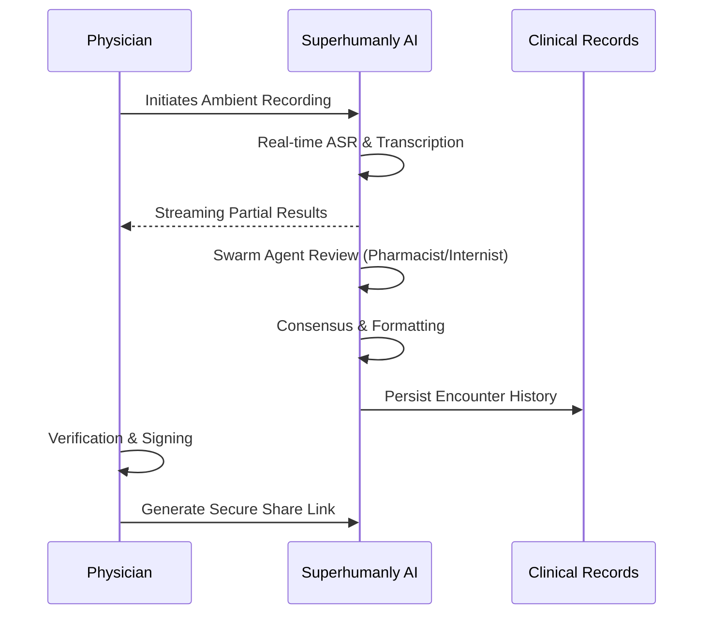

# Physician's Manual: Clinical Workflow & Intelligence

Welcome to the Superhumanly Doctors Physician Portal. This guide outlines the clinical workflow designed to minimize documentation overhead while maximizing clinical precision.

---

## 1. Clinical Encounter Intake

The platform supports three primary modes of clinical data entry, accessible via the **Clinical Encounter** tab.

### 🎙️ Ambient Intake (Primary Workflow)
The most efficient way to use the platform. Simply click **"Start Recording"** at the beginning of a patient encounter.
- **High-Fidelity ASR**: The system uses medical-grade transcription to capture nuanced clinical conversations.
- **Privacy First**: Audio is processed securely and is not stored permanently beyond the extraction phase.

### 📂 Clinical File Upload
Upload pre-recorded audio files or existing clinical transcripts. Supported formats include `.mp3`, `.wav`, and `.txt`.

### ✍️ Direct Text Entry
Manually input encounter notes for rapid synthesis.

---

## 2. The "Nerve Center" Experience

Once intake is complete, the **Extraction Pipeline** initiates. You will see real-time updates through our **Streaming Intelligence (Strategy 5)**.

### Real-Time Synthesis
As the AI processes the encounter, you will see partial results appear in the dashboard:
1. **Raw Transcript**: Immediate visualization of captured dialogue.
2. **Cleaned Text**: A medical-grade correction of the raw transcript.
3. **Patient Summary**: A jargon-free narrative for the patient.
4. **Structured Prescription**: Extracted medications, dosages, and instructions.

### 🛡️ Clinical Review Protocols (Swarm Agents)
Every encounter is vetted by a multi-agent clinical swarm before finalization:
- **Pharmacist Agent**: Scans for medication conflicts and dosage anomalies.
- **Internist Agent**: Reviews the summary for holistic clinical consistency.
- **Consensus Layer**: Synthesizes agent feedback to ensure the highest degree of accuracy.

---

## 3. Post-Encounter Actions

### Verification Pulse
Before finalizing, review the **Verification** tab. This provides a "pulse" check on:
- **Clinical Accuracy**: Confidence scores for extracted data.
- **Pharmacy Protocols**: Compliance with standard prescription schemas.

### Secure Sharing
Click **"Share with Patient"** to generate a time-limited, secure link. This allows patients to view their jargon-free summary and instructions without granting access to their full clinical record.

---

## 🏗️ Physician Workflow Map

